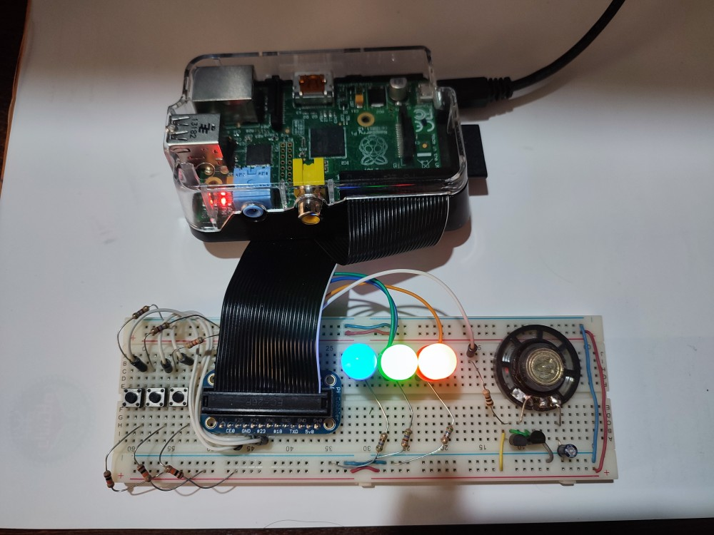

# Raspberry Pi ARM Assembly Music Box 🎵

A Simple ARM assembly project that turns your Raspberry Pi into a simple music box, toggling GPIO pins to create LED blinking effects and produce musical notes from a speaker. The application demonstrates low-level programming using memory-mapped I/O, precise timing for sound generation, and convenient scripts for local or remote deployments.



### Video demo is also available on [this link](https://drive.google.com/file/d/1nqHnOkC3rWKB00iR3wW05S0pqsS1SXKc/view).

## Features ✨

- **6 Pre-loaded Melodies** (Twinkle Twinkle, Happy Birthday, Für Elise, etc.)
- **LED Visualization** synchronized with music (RGB LEDs)
- **Button Controls** for melody selection & loop toggling
- **Remote Management** via `run_rmt.sh` script (sync code, start/stop service)
- **Systemd Service** for auto-start on boot
- **Assembly Language:** Written entirely in ARM assembly for direct hardware control
- **GPIO Control:** Uses memory-mapped I/O for direct pin manipulation
- **Precise Timing:** Employs `nanosleep` syscall for accurate frequency generation

## Hardware Setup 🛠️

### Requirements :

- Raspberry Pi 1 / Zero (BCM2835 SoC Chip)
- 3x Tactile buttons
- RGB LED
- Buzzer/Speaker
- Resistors (220Ω for LEDs, 10kΩ pull-up for buttons)

### Circuit Config

- **LEDs**:    GPIO **17** (Red), GPIO **27** (Green), GPIO **22** (Blue)
- **Buttons**: GPIO **23** (BTN1), GPIO **24** (BTN2), GPIO **25** (BTN3)
- **Speaker**: GPIO **4**

	(These configs are modifiable in [**main.s**](main.s) `.eqv` defines)

## Project Structure 📃

- **[main.s](main.s)**  
	Entrypoint of the application: sets up the environment, defines GPIO pin assignments for speaker/LEDs/buttons, orchestrates music playback, and initializes system resources. Main Loop is also here.

- **[gpiofuncs.s](main.s)**  
	Low-level GPIO handling code: configures and manipulates the Raspberry Pi GPIO pins through direct memory mapping, enabling toggling of pins to control LEDs and other peripherals.

- **[delay.s](delay.s)**  
	Provides high-precision delays using the nanosleep syscall. These timing functions are essential for generating accurate frequencies for music tones and for ensuring LEDs flash at predictable rates.

- **[iofuncs.s](iofuncs.s)**  
	Contains basic input/output routines in ARM assembly, allowing the program to print messages and handle simple I/O tasks via the standard library calls.

- **[strfuncs.s](strfuncs.s)**  
	Provides string-handling utilities (length calculations, comparisons, etc.) useful throughout the project for handling various text-based tasks. (This is cause of we don't need to use gcc!)

- **[macros.s](macros.s)**  
	A collection of assembly macros that streamline repetitive operations, stack management, register preservation, syscall definitions, and function-call boilerplate under ARM calling conventions.

- **Script [run.sh](run.sh)**  
	A local script to assemble and link the code on your development machine. Automates compiling all relevant .s files and produces an executable.

- **Script [install.sh](install.sh)**  
	Installs the required files and sets up the project as a systemd service (`musicbox.service`), automatically starting and managing this music box on boot of the Raspberry Pi.

- **Script [run_rmt.sh](run_rmt.sh)**  
	A script designed for remote deployment onto a target Raspberry Pi. Enables synchronization of local changes to the remote host and provides commands to start, stop, or kill the service remotely. (Described in next sections)

## Getting Started 📥

You can clone this Repository on your local machine and then use `run_rmt.sh` script for installing the system on your Raspberry Pi.

Also you can clone directly this repository on your raspberry pi and use `run.sh` for test run and `install.sh` for automate run at system startup.

### -> The way of Remote Installing (From your local machine)

1. **First, Ensure you have configured SSH correctly and using identity file `~/.ssh/id_rasp` for connecting to your Raspberry Pi, into a user that name is `myraspberry` (with sudo permission) in your Raspberry Pi.** (For a different configuration, you have to change the `run_rmt.sh` script)

2. Clone or download this repository to your local machine.

3. Run the provided script:
	```
	./run_rmt.sh <remote-hostname> <command>
	```
	Useful commands include: `sync`, `run`, `sync-run`, `kill`, `install`, `start`, `stop`.

	- For Example: `./run_rmt.sh 192.168.1.9 install`

<br>

### -> The way of Local Installing (Inside your Raspberry Pi)

For installing as a systemd service (requires root privileges on the Raspberry Pi):
```bash
./install.sh
```
This will register and enable the `musicbox.service` so it launches on boot.

You can manage the musicbox Service using commands below:
-   **Start/Stop/Enable/Disable the service:**
    ```bash
    sudo systemctl <start|stop|enable|disable> musicbox
    ```

## Usage

When the program launches (by test run or system startup), you'll see an LED blinky demonstration that continues until any button is pressed. Then you can control the music box with buttons as follows:

| Button Combination | Action |
|-------------------|---------|
| Button 1 | Plays "Twinkle Twinkle Little Star" |
| Button 2 | Plays "Happy Birthday" |
| Button 1 + 2 | Plays "Row Row Row Your Boat" |
| Button 3 | Plays "Jingle Bells" |
| Button 1 + 3 | Plays "Persian Tavalodet Mobarak" |
| Button 2 + 3 | Plays "Für Elise" |
| All Buttons | Toggles looping mode (melody will repeat when finished) |

**Important Note:** Button presses are checked only at specific moments (e.g. it's not checked during melody playback). so, you must hold the buttons enough to the program recognize that.

Each melody is accompanied by synchronized LED patterns, with the RGB LED changing colors in rhythm with the music. The speaker generates the corresponding musical notes through GPIO pin toggling.

## Technical Details 🔧

- **Memory-Mapped I/O**:
	- Direct control of GPIO pins through memory mapping
	- Uses `GPIO_BASE` address defined in [gpiofuncs.s](gpiofuncs.s)
	- `mmap2` syscall maps physical memory to virtual addresses

- **Frequency Generation**:
	- Square wave generation via GPIO pin toggling
	- `__gpio_generate_freq` function in [gpiofuncs.s](gpiofuncs.s)
	- High-precision timing using `nanosleep` syscall

- **ARM Assembly & System Integration**:
	- Written in ARM32 assembly with standard calling conventions
	- Uses syscalls: `open`, `mmap2`, `nanosleep`, `exit`, `read`, `write`
	- Proper register usage and stack management
	- Systemd integration for service automation

## Future Development 🚀

- **Implement PWM for improved frequency generation**
- **Use Interrupt or psudo-interrupt approch for handle buttons**
- Add support for reading music notes from files
- Implement basic audio synthesis

## Useful Resources & References 🔗
- [RaspberryPi 1 B GPIO](https://elinux.org/RPi_Low-level_peripherals#General_Purpose_Input.2FOutput_.28GPIO.29)
- [BCM2835 (Raspberry Pi 1 B SoC) ARM Peripherals Datasheet](https://www.raspberrypi.org/app/uploads/2012/02/BCM2835-ARM-Peripherals.pdf)  
- [BCM2835 Datasheet Errata](https://elinux.org/BCM2835_datasheet_errata)  
	[RPi BCM2835 GPIOs Information](https://elinux.org/RPi_BCM2835_GPIOs)
- [Flash Raspberry Pi LED using ARM Assembly (StackOverflow)](https://stackoverflow.com/questions/42702056/flash-raspberry-pi-led-using-arm-assembly)
- [Memory Mapped GPIO Registers](https://forums.raspberrypi.com/viewtopic.php?t=305042)
- [Generate a Steady 37kHz GPIO Trigger (PWM)](https://stackoverflow.com/questions/16534668/how-to-generate-a-steady-37khz-gpio-trigger-from-inside-linux-kernel)
- [mmap2 syscall Manual](https://man7.org/linux/man-pages/man2/mmap2.2.html)
- [First ARM Assembly GPIO Example](https://gist.github.com/Kaapiii/cb2011bc1ddd28c46945f0191af50079)
- [ARM32 Calling Conventions and Registers (StackOverflow)](https://stackoverflow.com/questions/261419/what-registers-to-save-in-the-arm-c-calling-convention)
- [Syscall Table for All Architectures](https://gpages.juszkiewicz.com.pl/syscalls-table/syscalls.html)
- [GAS Documentation](https://sourceware.org/binutils/docs/as/)
- [Syscall Manual Page](https://man7.org/linux/man-pages/man2/syscall.2.html)
- [nanosleep Manual Page](https://man7.org/linux/man-pages/man2/nanosleep.2.html)

### Music & Note References
- [noobnotes.net](https://noobnotes.net/)  
- [musicca.com/piano](https://www.musicca.com/piano)  
- [KidsPlayMusic - Twinkle Twinkle & Row Row Row Your Boat](https://www.kidsplaymusic.com/)  
- [Fur Elise (Beginner)](https://musescore.com/dundeepiano/fur-elise-beginner-piano)  
- [Jingle Bells Piano](https://latouchemusicale.com/en/jingle-bells-piano/)
- [Some Linux Beep Musics](https://github.com/ShaneMcC/beeps)

#### Online Tune Detection Tool : [This Link](https://theonlinemetronome.com/instrument-tuner)

## Authors

- AmirHossein MohammadZadeh ([Github Page](https://github.com/ahmz1833))
- AmirReza Jafari ([Github Page](https://github.com/ARJ1383))


---
**Enjoy tinkering with ARM Assembly and making music!**
